<h1 align="center">Halftone</h1>

<p align="center">
  An Obsidian theme in the style of a retro desktop printed on paper:<br>
  black title bars, framed windows, pixel labels and a field of halftone dots.
</p>

<p align="center">
  
  
  
  
</p>

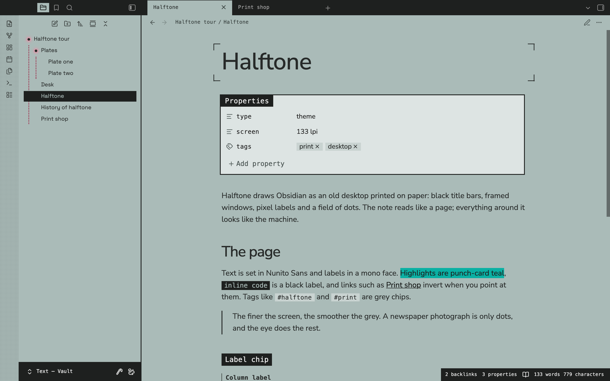

## Contents

- [At a glance](#at-a-glance)
- [Light and dark](#light-and-dark)
- [The page](#the-page)
- [Everything is a window](#everything-is-a-window)
- [File explorer](#file-explorer)
- [Dashboards](#dashboards)
- [Timelines](#timelines)
- [Paper and window colours](#paper-and-window-colours)
- [Joined windows, or a dotted desk](#joined-windows-or-a-dotted-desk)
- [Note width](#note-width)
- [New tab, modals and the small things](#new-tab-modals-and-the-small-things)
- [Phones and tablets](#phones-and-tablets)
- [Style Settings](#style-settings)
- [Note classes](#note-classes)
- [Customising with CSS variables](#customising-with-css-variables)
- [Palette](#palette)
- [Type](#type)
- [Installation](#installation)
- [Compatibility notes](#compatibility-notes)
- [Licence](#licence)

## At a glance

- **Every tab group is a window**: a frame, a black title bar and a paper body. Callouts, code blocks, tables, the properties block, menus and modals are windows too.
- **Three papers for light mode**: sage (the default), pink, or white windows on a pink desk. Dark mode has its own palette rather than an inverted one.
- **Real halftone**: the dots snap to whole screen pixels at every zoom level and screen density, so the grid stays even and never shimmers.
- **Square and flat**: no rounded corners and no shadows, anywhere.
- **No chevrons**: every chevron in Obsidian becomes a dot, lit while what it opens is open. Folders hang their contents from dotted guide lines.
- **Dashboards and timelines** from plain Markdown, switched on per note with `cssclasses`.
- **Adjustable note width**: a slider for every note, and classes for single notes.
- **Self-contained**: the fonts are embedded and the theme makes no network requests.

## Light and dark

<table>
  <tr>
    <td width="50%"></td>
    <td width="50%">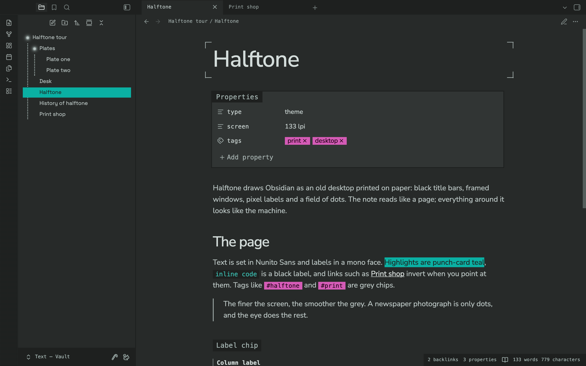</td>
  </tr>
  <tr>
    <td align="center"><sub>Light: sage paper, graphite ink, black title bars</sub></td>
    <td align="center"><sub>Dark: graphite paper, sage text, teal selection, magenta tags</sub></td>
  </tr>
</table>

Dark mode is not the light theme turned inside out. It takes its palette from a second reference: graphite paper, near-black frames and title bars, sage text and line art, teal for selection and highlights, and magenta label chips for tags.

## The page

The note itself reads like a printed page, and everything around it looks like the machine.

- **The note title sits inside crop marks**, like a proof sheet. Style Settings can hide them or centre the title.
- **Headings**: H1 to H3 are set in the text face with tight tracking. H4 is a black label chip, H5 a mono column label with a rule on its left, and H6 a caption in capitals.
- **Highlights are punch-card teal.** Links inside a highlight take the highlight's ink, so they stay readable in both modes.
- **Inline code is a black label**, and tags are grey chips that turn magenta when you point at them.
- **Links invert when you point at them**, like a selected menu item.
- **Horizontal rules are a band of halftone**, and blockquotes carry a solid rule in the line-art colour.

## Everything is a window

<table>
  <tr>
    <td width="50%">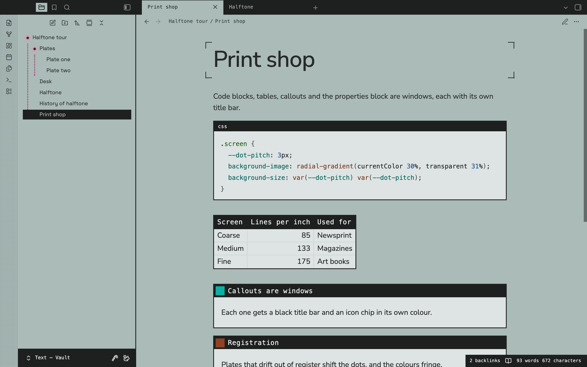</td>
    <td width="50%">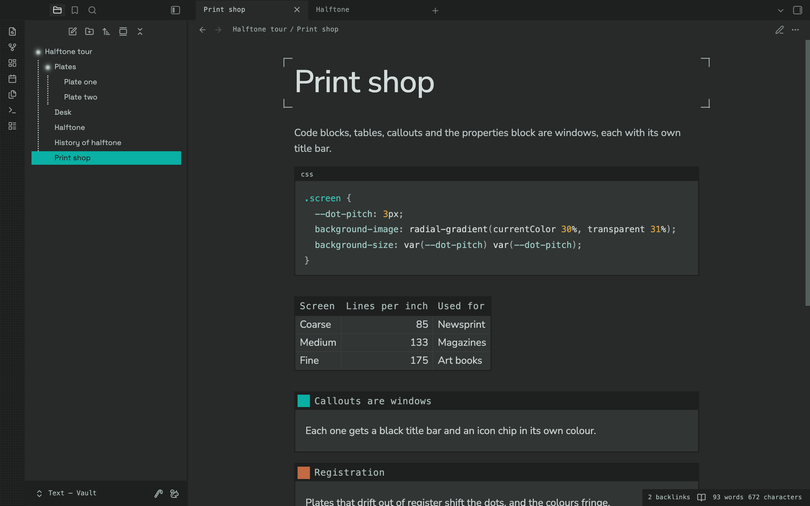</td>
  </tr>
</table>

- **Code blocks** get a title bar that names the language, with the copy button in the bar.
- **Tables** get a black header row and a frame.
- **Callouts** get a title bar and an icon chip in the callout's own colour. The icon turns black or white, whichever reads on that colour.
- **Properties** sit in a window titled *Properties*.
- **Menus, modals, the command palette and the switchers** are framed windows with title bars. Behind a modal, a halftone screen covers the workspace.

## File explorer

<p align="center">
  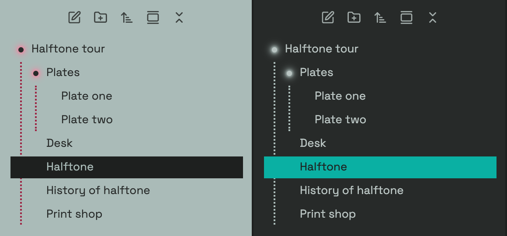
</p>

Folders show a small dot instead of the chevron. The dot takes the colour of the folder's name and glows while the folder is open, so you can see at a glance what is expanded.

The same dot replaces every other chevron in Obsidian:

- **Fold toggles** for headings, lists, callouts, the properties block, HTML `<details>`, and every tree (outline, bookmarks, tags, search and backlinks). The dot glows while the section is open.
- **Menus and pickers**: the vault switcher, the tab list, submenus, navigable rows in Settings and the Bases views menu. The dot glows while you point at it or its menu is open.
- **Collapse all**: the explorer's button glows while anything is open, which is when it collapses everything.
- **Dropdowns** end in a dot instead of an arrow.

Open folders hang their contents from dotted guide lines: raspberry on sage paper, maroon on pink paper and sage in dark mode. Bookmarks, the outline and search results get the same dotted guides.

## Dashboards

<table>
  <tr>
    <td width="50%">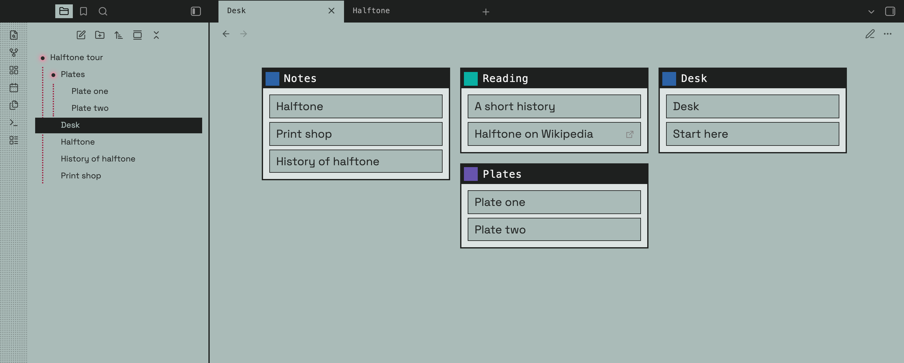</td>
    <td width="50%">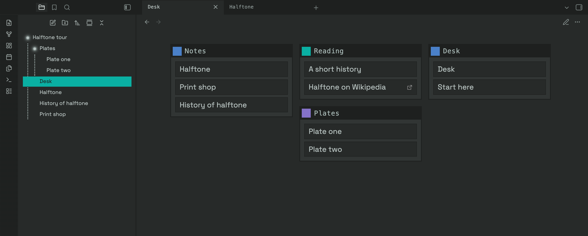</td>
  </tr>
</table>

Add `dashboard` to a note's `cssclasses` and, in reading view, its callouts become cards. Add `hide-all` as well to hide the note title and properties.

```markdown
---
cssclasses:
  - dashboard
  - hide-all
---

> [!note] Notes
> - [[Halftone]]
> - [[Print shop]]

> [!tip] Reading
> - [[A short history]]
> - [Halftone on Wikipedia](https://en.wikipedia.org/wiki/Halftone)
```

- **Cards pack into columns at their own height**, so no card is padded out with empty space. Each card keeps one width, 300px by default.
- **The columns are centred** and sized to whole cards. One or two cards sit in the middle instead of filling the first columns of a wide box.
- **Groups**: a heading or a line of text between cards starts a new group and spans the full width.
- **Links in a card become framed rows** that invert when you point at them.
- **With `hide-all`**, the view header floats over the cards and shows only its buttons.
- **Width**: a dashboard grows to 1400px, or to the width set by a [width class](#note-width) such as `width-1200`.
- **Live Preview** keeps the cards in one centred column, so they stay easy to edit.
- **A hand-written `<div class="dashboard-grid">`** lays out the callouts inside it as a plain grid.

## Timelines

<table>
  <tr>
    <td width="50%">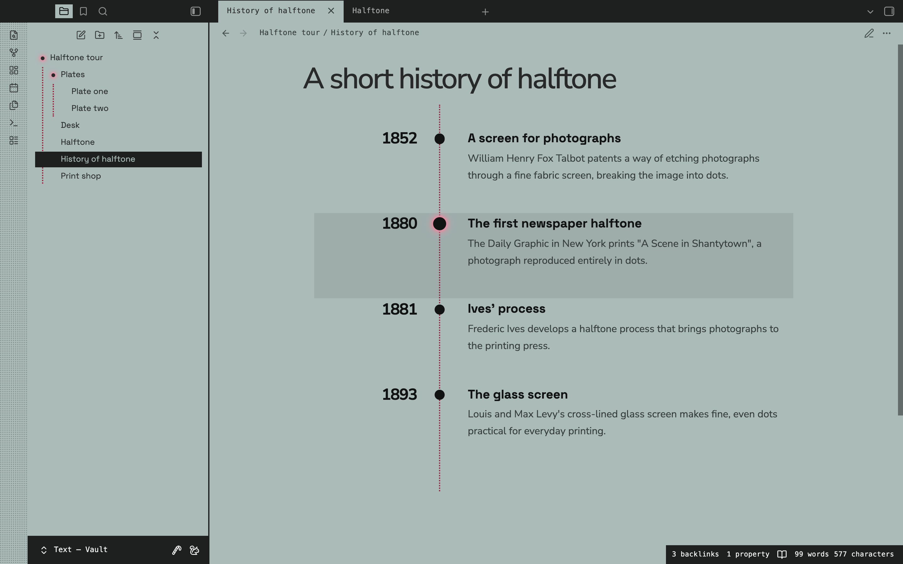</td>
    <td width="50%">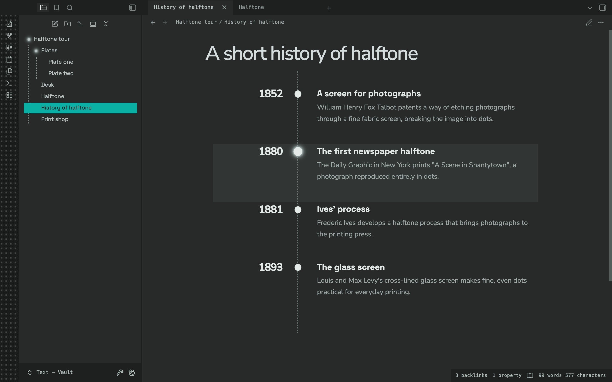</td>
  </tr>
</table>

Add `custom-timeline` to a note's `cssclasses` and, in reading view, a list becomes a timeline. Every three items make one entry: a date, a title and a line of text.

```markdown
---
cssclasses:
  - custom-timeline
---

- 1880
- The first newspaper halftone
- The Daily Graphic in New York prints "A Scene in Shantytown".
- 1893
- The glass screen
- Louis and Max Levy's cross-lined glass screen makes fine, even dots practical.
```

- **Dates sit to the left of a dotted spine**, drawn in the same colour as the file explorer's guide lines.
- **Each date has a dot.** Point at an entry and the entry tints while its dot grows and glows.
- **Titles and text slide in** when the note opens. If your system asks for reduced motion, they appear without moving.
- **On phones** the timeline becomes a single column, with the spine on the left.

## Paper and window colours

<p align="center">
  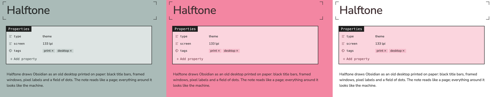
</p>

Light mode prints on **sage** paper by default. In Style Settings you can switch to **pink** paper, or to **white windows on a pink desk**.

The **window colour** covers fields, properties, callouts, code, tables and menus. It can be blush, sage mist, panel grey or white. On sage paper, blush shows as sage mist.

## Joined windows, or a dotted desk

<p align="center">
  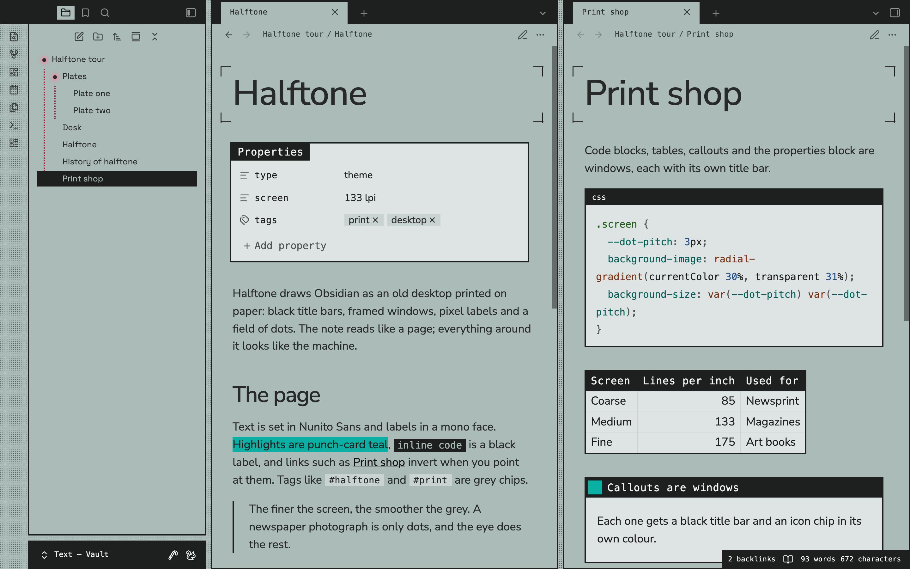
</p>

By default the windows join edge to edge. Turn on **Separate the windows with a dotted gap** in Style Settings and each tab group becomes a framed window standing on a dotted desk, which shows only in the gaps between windows.

## Note width

Style Settings has a **Note width** slider, from 500 to 1600px and 720px by default. It applies while Obsidian's *Readable line length* is on.

To set the width of one note, add a class to its `cssclasses`. A width class works even with *Readable line length* off, on screens at least 768px wide.

| Class | Note width |
| --- | --- |
| `width-800` | 800px |
| `width-900` | 900px |
| `width-1000` | 1000px |
| `width-1200` | 1200px |
| `width-1600` | 1600px |
| `full-width` | the whole pane |

## New tab, modals and the small things

<table>
  <tr>
    <td width="50%">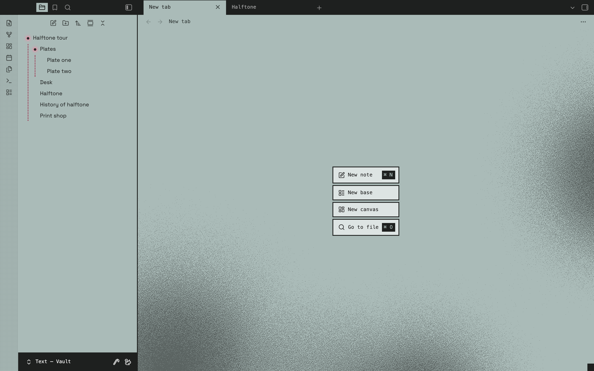</td>
    <td width="50%">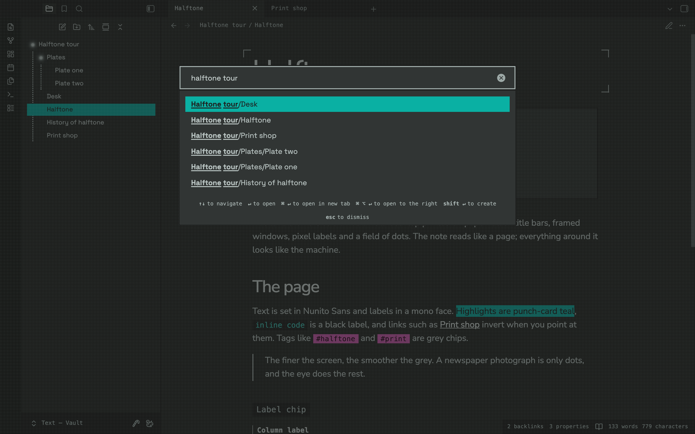</td>
  </tr>
  <tr>
    <td align="center"><sub>A new tab</sub></td>
    <td align="center"><sub>The quick switcher</sub></td>
  </tr>
</table>

- **New tab**: an empty tab shows a faint halftone cloud behind framed buttons.
- **Selection**: the selected row in menus, lists and switchers inverts, in black on light paper and teal in dark mode.
- **Scrollbars** are square and thin, and show only while the pointer is over the window. On macOS the theme draws them in place of the system's rounded ones.
- **Chrome**: the status bar is a small window in the corner, and the vault profile is a small window at the foot of the left sidebar, level with the main window's bottom edge.
- **No shadows**: menus, modals, pop-ups, notices and cards are flat, framed windows.

## Phones and tablets

- **Phones** get one full-bleed window, and the desk never shows.
- **Controls** are touch-sized and still square. The bottom bar, the floating header buttons and the toolbar above the keyboard are black chips.
- **Menus** open as sheets, and drawers have a frame on their open edge.
- **Tablets** keep the windows.

## Style Settings

Halftone works without any plugin. With [Style Settings](https://github.com/mgmeyers/obsidian-style-settings) installed, these options appear under *Halftone*:

| Setting | Options | Default |
| --- | --- | --- |
| Paper | Sage, Pink, White windows on a pink desk | Sage |
| Window colour | Blush, Sage mist, Panel grey, White | Blush |
| Note width | 500 to 1600px | 720px |
| Separate the windows with a dotted gap | on or off | off |
| Turn off the halftone dots | on or off | off |
| Hide the crop marks around the note title | on or off | off |
| Centre the note title | on or off | off |
| Headings in Space Grotesk | on or off | off |
| Pixel font in the file explorer | on or off | off |

## Note classes

Add any of these to a note's `cssclasses` property.

| Class | What it does |
| --- | --- |
| `dashboard` | Reading view lays the note's callouts out as packed cards. See [Dashboards](#dashboards). |
| `custom-timeline` | Reading view turns a list into a timeline. See [Timelines](#timelines). |
| `hide-all` | Hides the note title and properties. |
| `width-800` to `width-1600`, `full-width` | Sets the width of that note. See [Note width](#note-width). |

## Customising with CSS variables

Every colour and size is a variable, so a short [CSS snippet](https://help.obsidian.md/snippets) is enough to change one. Use `html body.theme-light` and `html body.theme-dark` as the selector, so the snippet outranks the theme:

```css
html body.theme-light,
html body.theme-dark {
  --hf-guide-color: #2D63A7;      /* file-tree guide lines and the timeline spine */
  --hf-blob-opacity: 0.35;        /* strength of the halftone on a new tab */
  --hf-dashboard-col-width: 260px;
}
```

| Variable | Controls | Default |
| --- | --- | --- |
| `--hf-guide-color` | File-tree guide lines and the timeline spine | raspberry `#9D2645`, maroon on pink paper, sage in dark mode |
| `--hf-guide-width`, `--hf-guide-style` | How the guide lines are drawn | `2px`, `dotted` |
| `--hf-dot-size` | Every dot that replaces a chevron | `6px` |
| `--hf-dot-color` | Its colour | the colour of the text around it |
| `--hf-dot-glow-color` | Its glow while open | pink, maroon on pink paper, sage in dark mode |
| `--hf-blob-opacity` | The halftone on a new tab, from `0` to `1` | `0.6` |
| `--hf-scrollbar-size` | Scrollbar thickness | `8px` |
| `--hf-note-width` | Note width with *Readable line length* on | `720px` |
| `--hf-dashboard-col-width` | Dashboard card width | `300px` |
| `--hf-dashboard-gap` | Space between dashboard cards | `16px` |
| `--hf-dashboard-max-width` | Widest a dashboard grows without a width class | `1400px` |
| `--hf-tl-date-width` | Width of the timeline's date column | `200px` |
| `--hf-tl-row-gap` | Space between timeline entries | `2.5rem` |
| `--hf-tl-max-width` | Width of a timeline note | `800px` |
| `--hf-tl-dot-size`, `--hf-tl-dot-color` | The dot on each date | `0.9rem`, the strong text colour |
| `--hf-tl-spine-color` | The timeline's spine | the guide colour |
| `--hf-gap` | Gap between windows when separated | `8px` |
| `--hf-frame` | Thickness of every window frame | `2px` |
| `--hf-crop-length`, `--hf-crop-weight` | The crop marks around the note title | `16px`, `1.5px` |

## Palette

| Role | Sage paper | Pink paper | Dark |
| --- | --- | --- | --- |
| Paper | `#AABBB8` | `#F386A2` | `#272A29` |
| Desk between windows | `#AABBB8` | `#F386A2` | `#1A1C1B` |
| Text | `#272A29` | `#3D2D30` | `#B9C4C2` |
| Headings | `#272A29` | `#3D2D30` | `#D3DCDA` |
| Title bars and frames | `#1E201F` | `#1E1E1E` | `#1E201F` |
| Line art: rules, checkboxes, crop marks | `#1E201F` | `#1E1E1E` | `#A4B0AE` |
| Halftone dots | `#272A29` | `#6F182C` | `#A4B0AE` |
| Window bodies | `#DDE4E3` sage mist | `#FBD5DE` blush | `#313534` |
| Highlights | `#0AB0A3` | `#0AB0A3` | `#0AB0A3` |
| Tag chips | `#C9D3D1`, `#D45BB6` on hover | `#F5BCCB`, `#D45BB6` on hover | `#D45BB6` with `#1E0013` text |
| Selection and the active file | black, sage text | black, pink text | `#0AB0A3`, graphite text |
| Guide lines | `#9D2645` | `#6F182C` | `#AABBB8` |
| Open-folder glow | `#F386A2` | `#6F182C` | `#AABBB8` |

Callout labels in light mode use `#308F26` green, `#2D63A7` blue, `#904226` orange, `#9D2645` red, `#C08726` yellow and `#6754AD` purple. Dark mode lifts each of them for contrast.

## Type

- **Text and headings**: Nunito Sans, with headings set tight. Style Settings can switch the note title and headings to Space Grotesk.
- **Interface**: Space Grotesk.
- **Labels, tabs, title bars and the status bar**: a mono face, SF Mono on macOS with fallbacks elsewhere, normalised with `font-size-adjust` so it sits at the same height as the text.
- **Code**: SF Mono, then your system's monospace font.

Space Grotesk and Nunito Sans are embedded in the theme, so text and interface look the same on every machine and the theme makes no network requests.

## Installation

1. Download [`theme.css`](theme.css) and [`manifest.json`](manifest.json) from this repository.
2. In your vault, create the folder `.obsidian/themes/Halftone` and put both files in it.
3. In Obsidian, open **Settings → Appearance → Themes** and choose **Halftone**.

Optionally, install [Style Settings](https://github.com/mgmeyers/obsidian-style-settings) to reach the options above.

## Compatibility notes

- **Requirements**: Halftone needs Obsidian 1.13 or later.
- **macOS menus**: right-click menus are native by default, so the system draws them. Turn off *Native menus* in **Settings → Appearance** to see the theme's menus.
- **Settings window**: Settings opens in its own window from Obsidian 1.13. That window already has a title bar, so the theme leaves its own out there.
- **Reading view only**: dashboards and timelines are laid out in reading view. Live Preview shows dashboards as one column of cards and timelines as a plain list.

## Licence

Halftone is released under the [MIT licence](LICENSE).

Space Grotesk and Nunito Sans are embedded under the SIL Open Font License 1.1.
